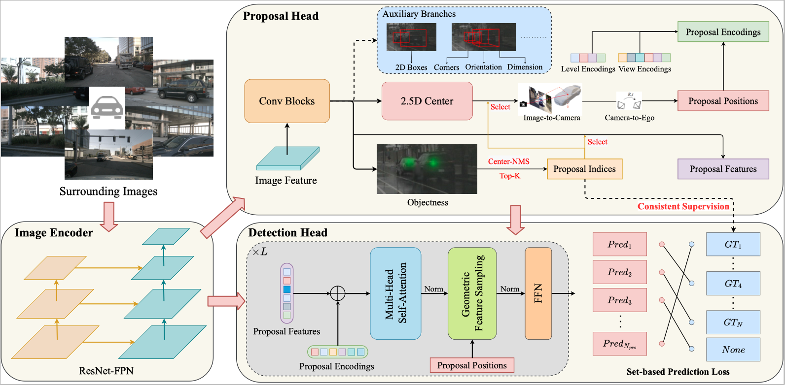

# SimMOD
Implementation of SimMOD: A Simple Baseline for Multi-Camera 3D Object Detection. (AAAI 2023)



## Installation
Check [installation](docs/installation.md) for installation.

## Data Preparation
Check [data_preparation](docs/data_preparation.md) for preparing the nuScenes dataset.

## Getting Started
To train SimMOD with 8 GPUs, run:
```bash
bash tools/dist_train.sh $CONFIG 8
```

For evaluation, use:
```bash
bash tools/dist_test.sh $CONFIG $CKPT 8 --eval=bbox
```

We provide the pretrained models for SimMOD.

|Method | Pretrain | mAP      | NDS     | Log | Weights |
|:------:|:----------:|:-------:|:--------:|:------:|:-----:|
| [SimMOD-r50](projects/configs/simmod/simmod_r50.py) | ImageNet | 33.1 | 42.7 | [log](https://github.com/zhangyp15/SimMOD/releases/download/v0.0.1-initial/simmod_r50.log) | [model](https://github.com/zhangyp15/SimMOD/releases/download/v0.0.1-initial/simmod_r50_ep24.pth) |
| [SimMOD-r101](projects/configs/simmod/simmod_r101.py) | ImageNet | 34.9 | 43.1 | [log](https://github.com/zhangyp15/SimMOD/releases/download/v0.0.1-initial/simmod_r101.log) | [model](https://github.com/zhangyp15/SimMOD/releases/download/v0.0.1-initial/simmod_r101_ep24.pth) |
| [SimMOD-r101](projects/configs/simmod/simmod_r101_fcos3d.py) | [FCOS3D](https://github.com/zhangyp15/SimMOD/releases/download/v0.0.1-initial/r101_dcn_fcos3d_pretrain_process.pth) | 37.0 | 45.4 | [log](https://github.com/zhangyp15/SimMOD/releases/download/v0.0.1-initial/simmod_r101_fcos3d.log) | [model](https://github.com/zhangyp15/SimMOD/releases/download/v0.0.1-initial/simmod_r101_fcos3d_ep24.pth) |
| [SimMOD-r101](projects/configs/simmod/simmod_r101_nuimg.py) | [NuImg](https://github.com/zhangyp15/SimMOD/releases/download/v0.0.1-initial/cascade_mask_rcnn_r101_fpn_1x_nuim_process.pth) | 37.6 | 46.1 | [log](https://github.com/zhangyp15/SimMOD/releases/download/v0.0.1-initial/simmod_r101_nuimg.log) | [model](https://github.com/zhangyp15/SimMOD/releases/download/v0.0.1-initial/simmod_r101_nuimg_ep24.pth) |

## Acknowledgement
This project is mainly based on [DETR3D](https://github.com/WangYueFt/detr3d). Thanks for their great work.

If you find this repo useful for your research, please consider citing the paper:
```
@article{zhang2022simple,
  title={A Simple Baseline for Multi-Camera 3D Object Detection},
  author={Zhang, Yunpeng and Zheng, Wenzhao and Zhu, Zheng and Huang, Guan and Zhou, Jie and Lu, Jiwen},
  journal={arXiv preprint arXiv:2208.10035},
  year={2022}
}
```